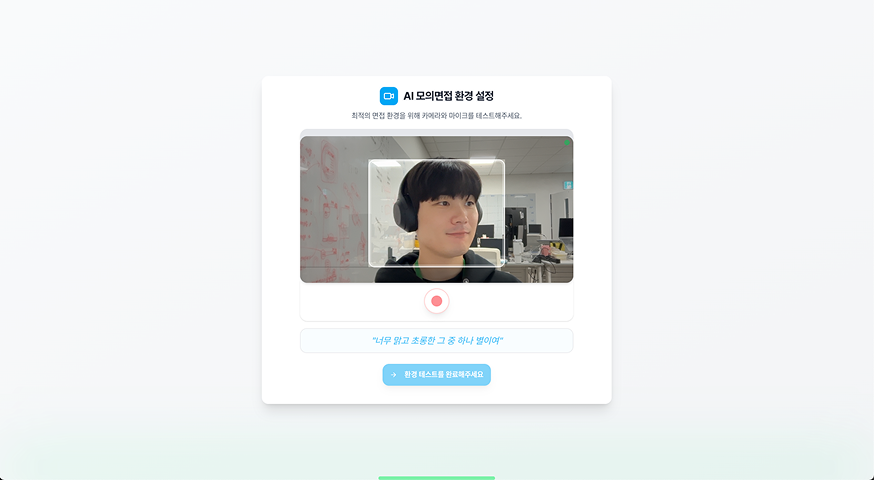
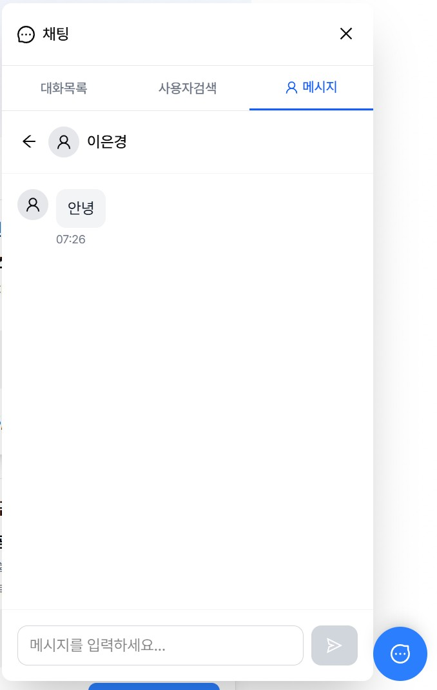

# Good-Job | 구직자를 위한 커리어 플랫폼

## 프로젝트 개요

- **프로젝트명**: Good-Job
- **한 줄 소개**: 사용자의 이력서를 기반으로 한 AI 면접과 Web RTC 를 활용한 실시간 멘토링 플랫폼
- **개발 기간**: 2024.08 - 2024.10 (약 3개월)
- **팀 구성**: Frontend 2명, Backend 3명
- **배포 URL**: https://good-job.shop/ (2025-10-15 기준 배포중)
- **GitHub**: https://github.com/Team-Ooleem/GoodJob_frontend

---

## 프로젝트 설명

### 배경 및 목적

요즘 취업 준비나 이직, 정말 쉽지 않죠.
특히 신입 구직자분들은 **이력서 작성**부터 **면접 준비**까지 막막함을 많이 느끼실 거예요.
이러한 어려움을 해소하기 위해, **AI 기반 모의면접**과 **멘토링 시스템**을 결합한 서비스를 기획했습니다.
사용자는 자신의 이력서를 업로드하고, 멘토링을 통해 피드백을 받거나 AI 면접으로 실전 감각을 기를 수 있습니다.

### 주요 기능

- **AI 모의 면접**: 사용자의 이력서를 바탕으로 맞춤형 질문을 생성하고 면접 진행
- **멘토링 시스템**: 실시간 영상통화를 통해 멘토에게 피드백 및 코칭을 받을 수 있음

---

## 담당 역할 및 기여도

- **역할**: Frontend 개발 리드
- **기여도**: 전체 프론트엔드 개발의 70% 담당
- **담당 파트**:
  - 개발 생산성 향상을 고려한 프론트엔드 아키텍처 설계 및 문서화
  - AI 모의면접 핵심 UX 설계 및 인터랙션 개발 주도
  - 사용자 간 실시간 커뮤니케이션 기능 구현
  - 서비스 안정성을 위한 인프라 설계 및 배포 환경 구축

---

## 기술 스택

**Frontend**

- Next.js 13, TypeScript
- Zustand (전역 상태 관리)
- Tanstack Query, axios (서버 상태 관리)
- Tailwind CSS, shadcn ui (스타일링 및 디자인 시스템 구축)

**Build & Deploy**

- AWS S3,EC2 (배포)
- GitHub Actions (CI/CD)

**Collaboration**

- Jira/Confluence (애자일 기반 일정 관리 및 문서화)
- Git/GitHub (코드 버전관리 및 Jira ticket 기반 브렌치 전략)
- Figma (UI 설계 협업 및 디자인)

---

## 주요 구현 내용

### 1. AI 모의면접 기능 - 몰입형 면접 경험 설계

- 실제 면접처럼 몰입할 수 있도록 ux 를 설계하여 구직자의 면접 준비 효율성 극대화
- 개인 맞춤형 질문 생성으로 내 이력서와 타겟 기업에 특화된 준비 가능

**구현 내용**

**1) 다단계 온보딩 플로우 - UX 중심 설계**

> 현재 어떤 단계를 진행하고 있는지 사용자가 명확히 알게 하고 진행 중 이탈 방지를 위해, 상세한 안내와 시각적 피드백을 제공했습니다.

- **이력서 업로드 단계**
  AI가 이력서를 파싱해서 면접 질문을 생성하는 동안 **사용자가 지루함을 느끼지 않도록 안내메세지**를 적절히 표시

- **미디어 권한 확인 단계**
  카메라/마이크 권한을 요청하고 **왜 필요한지 명확히 설명**하는 내용 안내

- **음성 캘리브레이션**
  사용자가 말할 때 화면 하단에 초록색 그라데이션 웨이브 애니메이션으로 **음성 인식 중임을 직관적으로 표시**

**2) 게이미피케이션을 통한 몰입도 향상**

> AI가 주는 피드백 메세지를 면접 도중 확인하기가 어려워서, 게임에서 사용되는 실시간 피드백 시스템을 차용하여 피드백을 직관적으로 확인하고 면접 연습이 지루하지 않도록 설계했습니다.

- **게이미피케이션 요소 도입**
  사용자가 쉽게 피드백을 확인할 수 있게 메세지를 적절한 곳에 위치시키고 몰입도에 따라 주의,위험 등으로 화면 색상을 변경하여 집중 유도

- **영상 분석**
  웹캠을 Mediapipe로 수집한 데이터를 정제해 사용자의 현 상황에 대한 여러가지 피드백을 제공

- **음성 분석**
  구글 STT를 활용해 사용자의 답변을 분석하고 다음 질문의 생성에 영향을 줄 수 있도록 설계

### 2. WebSocket 기반 실시간 채팅 시스템

- 구직자와 멘토/리크루터 간 즉각적인 소통 채널 제공

**구현 내용**

**1) 낙관적 업데이트(Optimistic Update)로 체감 성능 개선**

> 매우 자연스럽고 빠른 채팅 경험을 제공하기 위해, 낙관적 업데이트를 적용해 사용자가 서버 응답을 기다리지 않고 즉시 UI에 반영되도록 했습니다.

- **메시지 전송 시 서버 응답 전에 UI에 먼저 표시**
  Zustand 를 사용한 상태 관리를 통해 본인의 입력을 즉시 확인할 수 있음

**2) 연결 끊김 시 UX 처리**

> 오프라인 상황이거나 네트워크 에러인 경우의 명확한 피드백을 제공했습니다.

- **오프라인 UI 피드백 제공**
  오프라인 감지 시 사용자에게 명확한 피드백 제공

---

## 트러블슈팅 & 문제 해결

### 문제 1: Google STT API 지연으로 인한 면접 흐름 끊김

**상황**

- 사용자가 답변을 마친 후, Google STT API에서 텍스트 결과를 반환받기까지 3~5초의 지연 발생
- STT 결과가 늦어지면 다음 질문 생성이 지연되어 면접 흐름이 단절되고, 사용자 몰입도가 하락함

**해결 과정**

1. **질문 생성 속도와 품질 간 트레이드오프 조정**
   OpenAI API 의 temperature, top-p 파라미터를 조정해 **응답 품질 저하를 최소화 하며 응답 시간 40% 단축**

2. **UX 측면에서의 진행 상황을 시각적으로 보완**
   STT 결과 대기 시간 동안 "AI가 맞춤 질문을 생성하고 있어요" 라는 메시지와 프로그레스 바 추가로 대기 시간 피로도 완화

**결과**

- 전체 면접 세션 평균 응답 대기시간 **3 ~ 5초 -> 2 ~ 3초로 단축**
- 사용자 경험 개선 (저장 중 UI 피드백 명확화)

### 문제 2: WebSocket 재연결 시 채팅 메시지 동기화 문제

**상황**

- WebSocket 연결이 끊겼다 재연결 되면서 채팅 메시지 누락 또는 중복 발생
- 낙관적 업데이트 적용 후 실제 서버 응답과 로컬 상태가 불일치하는 경우 발생

**해결 과정**

1. **임시 Conversation 생성 및 낙관적 업데이트 적용**
   서버 응답을 기다리지 않고 즉시 UI 에 반영하기 위해 임시 temp_conversation 키를 생성 해당 부분에서 문제 발생

2. **백그라운드 동기화 및 ID 매핑**
   백그라운드에서 서버의 실제 conversation_id를 가져와 임시 키로 관리되던 메시지를 conversation 에 반영

3. **임시 데이터 정리 및 불일치 방지**
   temp\_로 된 임시 conversation을 자동 삭제하여 중복 메시지 표시 방지

**결과**

- 서버-클라이언트 간 메시지 정합성 100%유지
- 낙관적 업데이트 도입으로 사용자 체감 반응 채팅속도 개선

---

## 회고

2년간의 경력을 쌓으면서 일했던 경험보다
이 프로젝트를 하면서 스스로 고민하고 해결하려 했던 노력들이 더 의미있던 시간이었습니다.

팀원들을 위해 어떤 것들을 미리 설계해 두어야 편할지 고민하고
백엔드도 경험해보며 어떻게 작업하는지, 데이터는 어떤 식으로 설계되는지 이해하고
사용자가 어떻게 더 직관적으로 편하게 사용할지 UX를 설계했습니다.

스스로 "믿고 맡길 수 있는 팀원"이 되고 싶다는 생각을 하게 된 인생의 전환점입니다.

다만, 실제로 서비스 단계까지 가지 못한 건 아쉬움이 남습니다.

이후, 팀원들과 기간을 충분히 두고 서비스 해보는 경험을 가질 예정입니다.
