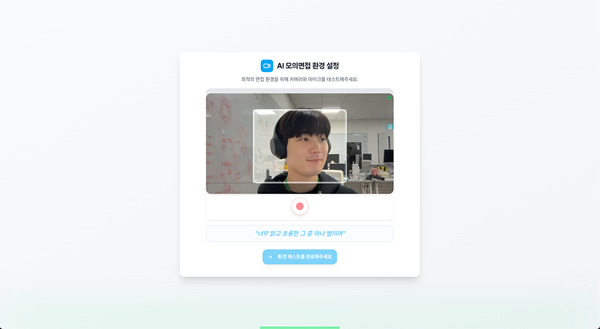

# Good-Job | 구직자를 위한 커리어 플랫폼

## 프로젝트 개요

- **프로젝트명**: Good-Job
- **한 줄 소개**: 사용자의 이력서를 기반으로 한 AI 면접과 Web RTC 를 활용한 실시간 멘토링 플랫폼
- **개발 기간**: 2024.08 - 2024.10 (약 3개월)
- **팀 구성**: Frontend 2명, Backend 3명
- **배포 URL**: https://good-job.shop/ (2025-10-15 기준 배포중)
- **GitHub**: https://github.com/Team-Ooleem/GoodJob_frontend

---

## 프로젝트 설명

### 배경 및 목적

요즘 취업 준비나 이직, 정말 쉽지 않죠.
특히 신입 구직자분들은 **이력서 작성**부터 **면접 준비**까지 막막함을 많이 느끼실 거예요.
이러한 어려움을 해소하기 위해, **AI 기반 모의면접**과 **멘토링 시스템**을 결합한 서비스를 기획했습니다.
사용자는 자신의 이력서를 업로드하고, 멘토링을 통해 피드백을 받거나 AI 면접으로 실전 감각을 기를 수 있습니다.

### 주요 기능

- **AI 모의 면접**: 사용자의 이력서를 바탕으로 맞춤형 질문을 생성하고 면접 진행
- **멘토링 시스템**: 실시간 영상통화를 통해 멘토에게 피드백 및 코칭을 받을 수 있음

---

## 담당 역할 및 기여도

- **역할**: Frontend 개발 리드
- **기여도**: 전체 프론트엔드 개발의 70% 담당
- **담당 파트**:
  - 개발 생산성 향상을 고려한 프론트엔드 아키텍처 설계 및 문서화
  - AI 모의면접 핵심 UX 설계 및 인터랙션 개발 주도
  - 사용자 간 실시간 커뮤니케이션 기능 구현
  - 서비스 안정성을 위한 인프라 설계 및 배포 환경 구축

---

## 기술 스택

**Frontend**

- Next.js 13, TypeScript
- Zustand (전역 상태 관리)
- Tanstack Query, axios (서버 상태 관리)
- Tailwind CSS, shadcn ui (스타일링 및 디자인 시스템 구축)

**Build & Deploy**

- AWS S3,EC2 (배포)
- GitHub Actions (CI/CD)

**Collaboration**

- Jira/Confluence (애자일 기반 일정 관리 및 문서화)
- Git/GitHub (코드 버전관리 및 Jira ticket 기반 브렌치 전략)
- Figma (UI 설계 협업 및 디자인)

---

## 주요 구현 내용

### 1. AI 모의면접 기능 - 몰입형 면접 경험 설계

- 실제 면접처럼 몰입할 수 있도록 ux 를 설계하여 구직자의 면접 준비 효율성 극대화
- 개인 맞춤형 질문 생성으로 내 이력서와 타겟 기업에 특화된 준비 가능

**구현 내용**

**1) 다단계 온보딩 플로우 - UX 중심 설계**

> 현재 어떤 단계를 진행하고 있는지 사용자가 명확히 알게 하고 진행 중 이탈 방지를 위해, 상세한 안내와 시각적 피드백을 제공했습니다.

- **이력서 업로드 단계**
  AI가 이력서를 파싱해서 면접 질문을 생성하는 동안 **사용자가 지루함을 느끼지 않도록 안내메세지**를 적절히 표시

- **미디어 권한 확인 단계**
  카메라/마이크 권한을 요청하고 **왜 필요한지 명확히 설명**하는 내용 안내

- **음성 캘리브레이션**
  사용자가 말할 때 화면 하단에 초록색 그라데이션 웨이브 애니메이션으로 **음성 인식 중임을 직관적으로 표시**

**2) 게이미피케이션을 통한 몰입도 향상**

> AI가 주는 피드백 메세지를 면접 도중 확인하기가 어려워서, 게임에서 사용되는 실시간 피드백 시스템을 차용하여 피드백을 직관적으로 확인하고 면접 연습이 지루하지 않도록 설계했습니다.

- **게이미피케이션 요소 도입**
  사용자가 쉽게 피드백을 확인할 수 있게 메세지를 적절한 곳에 위치시키고 몰입도에 따라 주의,위험 등으로 화면 색상을 변경하여 집중 유도

- **영상 분석**
  웹캠을 Mediapipe로 수집한 데이터를 정제해 사용자의 현 상황에 대한 여러가지 피드백을 제공

- **음성 분석**
  구글 STT를 활용해 사용자의 답변을 분석하고 다음 질문의 생성에 영향을 줄 수 있도록 설계

### 2. WebSocket 기반 실시간 채팅 시스템

- 구직자와 멘토/리크루터 간 즉각적인 소통 채널 제공

**구현 내용**

**1) 낙관적 업데이트(Optimistic Update)로 체감 성능 개선**

> 채팅 입력 후 UI가 업데이트되기까지 대략 0.1초 정도의 지연이 발생하여, 낙관적 업데이트를 구현해 즉각적인 UI 갱신을 통해 체감 응답 속도를 향상시켰습니다.

- **메시지 전송 시 서버 응답 전에 UI에 먼저 표시**
  Zustand를 사용한 상태 관리를 통해 본인의 입력을 즉시 확인할 수 있음

- **UUID 기반 메시지 동기화 시스템 구축**
  낙관적 업데이트 구현 후 메시지 전송 실패 시 데이터 정합성이 맞지 않는 문제를 UUID 기반 메시지 동기화로 해결하여 데이터 정합성 보장

**2) 연결 끊김 시 UX 처리**

> 오프라인 상황이거나 네트워크 에러인 경우의 명확한 피드백을 제공했습니다.

- **오프라인 UI 피드백 제공**
  오프라인 감지 시 사용자에게 명확한 피드백 제공

### 3. 번들 크기 최적화를 통한 초기 로딩 속도 개선

- 사용자 경험 향상을 위한 성능 최적화에 집중

**구현 내용**

**1) 마크다운 에디터 라이브러리 교체**

> 610KB의 무거운 마크다운 에디터 라이브러리 @uiw/react-md-editor를 경량 대안으로 교체하여 번들 크기를 50% 감소시켰습니다.

- **번들 크기 대폭 감소**
  600KB → 310KB로 번들 크기 절반으로 축소

**2) 코드 스플리팅을 통한 초기 로딩 최적화**

> Next.js App Router의 동적 임포트를 활용해 불필요한 초기 로딩 리소스를 최소화했습니다.

- **동적 임포트 적용**
  필요한 시점에만 컴포넌트를 로드하여 초기 번들 크기 감소

- **무거운 영상 분석 라이브러리 최적화**
  Mediapipe, Face Landmark 등 무거운 영상 분석 라이브러리를 동적 임포트로 구현하여 AI 면접 시작 시점에만 로드되도록 최적화

- **성능 지표 개선**
  최종적으로 Lighthouse의 FCP(First Contentful Paint)를 0.4초로 개선

### 4. UI 라이브러리의 이미지 최적화 문제 해결

- 디자인 시스템 적용 과정에서 발견한 성능 문제 개선

**구현 내용**

**1) shadcn/ui 컴포넌트 최적화**

> 디자인 시스템을 적용하기 위한 shadcn/ui Avatar 컴포넌트가 일반 `` 태그를 사용하여 최적화가 되지 않는 문제를 발견했습니다.

- **Next.js Image 컴포넌트로 교체**
  일반 `` 태그를 asChild를 사용하여 Next.js의 Image 컴포넌트로 변경하여 전송량 30% 개선

- **자동 이미지 최적화 적용**
  WebP 포맷 변환 및 적절한 크기 조정으로 네트워크 리소스 절감

---

## 트러블슈팅 & 문제 해결

### 문제 1: Google STT API 지연으로 인한 면접 흐름 끊김

**상황**

- 사용자가 답변을 마친 후, Google STT API에서 텍스트 결과를 반환받기까지 3~5초의 지연 발생
- STT 결과가 늦어지면 다음 질문 생성이 지연되어 면접 흐름이 단절되고, 사용자 몰입도가 하락함

**해결 과정**

1. **단계별 진행 상황을 시각적으로 명확하게 표시**

   - **STT 변환 중**: "답변을 분석하고 있어요" 메시지 표시
   - **GPT 질문 생성 중**: "맞춤 질문을 생성하고 있어요" 메시지 표시
   - 각 단계별 프로그레스 바와 안내 메시지로 사용자가 현재 어떤 처리가 진행 중인지 명확히 인지할 수 있도록 개선

2. **대기 시간 동안의 사용자 경험 개선**
   - 부드러운 애니메이션과 시각적 피드백으로 대기 시간 체감 감소

**결과**

- 실제 대기 시간은 동일하지만, 단계별 피드백으로 **체감 대기 시간 피로도 완화**
- 사용자가 "멈춘 것"이 아닌 "진행 중"임을 명확히 인지하여 면접 흐름 유지 및 이탈률 감소

### 문제 2: 낙관적 업데이트 구현 후 메시지 동기화 문제

**상황**

- 채팅 입력 후 UI 업데이트까지 약 0.1초의 지연이 발생하여 사용자 경험 저하
- 낙관적 업데이트를 적용했으나, 메시지 전송 실패 시 로컬 상태와 서버 상태 간 데이터 정합성 불일치 문제 발생
- WebSocket 연결이 끊겼다 재연결되면서 채팅 메시지 누락 또는 중복 표시

**해결 과정**

1. **낙관적 업데이트 적용으로 즉각적인 UI 반응 구현**
   사용자가 메시지를 전송하면 서버 응답을 기다리지 않고 즉시 UI에 반영하여 체감 응답 속도 대폭 개선

2. **UUID 기반 메시지 동기화 시스템 구축**

   - 각 메시지에 고유한 UUID를 부여하여 로컬 메시지와 서버 메시지를 정확히 매핑
   - 서버로부터 실제 메시지 ID를 받으면 UUID를 통해 임시 메시지를 실제 메시지로 교체

3. **전송 실패 시 재시도 및 롤백 처리**

   - 메시지 전송 실패 감지 시 사용자에게 명확한 피드백 제공
   - 실패한 메시지를 로컬 상태에서 제거하거나 재전송 옵션 제공

4. **임시 데이터 정리 및 중복 방지**
   동기화 완료 후 임시 메시지를 자동 삭제하여 중복 메시지 표시 방지

**결과**

- 메시지 전송 시 사용자가 체감하는 응답 속도 대폭 향상 (즉각 반영)
- UUID 기반 동기화로 서버-클라이언트 간 메시지 정합성 100% 유지
- 네트워크 불안정 상황에서도 안정적인 채팅 경험 제공

### 문제 3: 무거운 마크다운 에디터로 인한 초기 로딩 지연

**상황**

- @uiw/react-md-editor 라이브러리가 610KB로 매우 무거워 초기 로딩 속도 저하
- 번들 분석 결과 마크다운 에디터가 전체 번들의 상당 부분을 차지
- 사용자가 첫 페이지 진입 시 불필요하게 긴 대기 시간 발생

**해결 과정**

1. **번들 분석을 통한 문제 파악**
   webpack-bundle-analyzer를 활용하여 어떤 라이브러리가 번들 크기를 크게 차지하는지 분석

2. **경량 대안 라이브러리 검토 및 교체**

   - 기능은 유지하면서 더 가벼운 마크다운 에디터 라이브러리로 교체
   - 번들 크기 600KB → 310KB로 50% 감소

3. **동적 임포트를 통한 코드 스플리팅**
   - Next.js의 동적 임포트(dynamic import)를 활용하여 마크다운 에디터를 필요한 시점에만 로드
   - 초기 번들에서 제외하여 First Contentful Paint 시간 단축

**결과**

- 전체 번들 크기 50% 감소 (600KB → 310KB)
- Lighthouse FCP(First Contentful Paint) 0.4초로 개선
- 사용자 첫 진입 시 체감 로딩 속도 대폭 향상

### 문제 4: shadcn/ui 컴포넌트의 이미지 최적화 미적용

**상황**

- 디자인 시스템을 위해 도입한 shadcn/ui Avatar 컴포넌트가 일반 `` 태그 사용
- Next.js의 자동 이미지 최적화가 적용되지 않아 불필요하게 큰 이미지 전송
- 프로필 이미지가 여러 곳에서 사용되어 전체 전송량에 큰 영향

**해결 과정**

1. **문제 원인 파악**

   - shadcn/ui Avatar 컴포넌트 내부 코드 확인
   - 일반 HTML `` 태그를 사용하여 Next.js 최적화가 적용되지 않음을 발견

2. **Next.js Image 컴포넌트로 교체**

   - shadcn/ui Avatar 컴포넌트의 내부 구현을 Next.js Image 컴포넌트로 수정
   - 자동 WebP 변환, 적절한 크기 조정, lazy loading 등 최적화 기능 활성화

3. **성능 측정 및 검증**
   - Network 탭을 통해 이미지 전송량 측정
   - 전송량 30% 감소 확인

**결과**

- 이미지 전송량 30% 감소로 네트워크 리소스 절감
- WebP 포맷 자동 변환으로 모던 브라우저에서 더 빠른 로딩
- Lazy loading으로 초기 페이지 로드 시 불필요한 리소스 요청 감소

---

## 회고

2년간의 경력을 쌓으면서 일했던 경험보다
이 프로젝트를 하면서 스스로 고민하고 해결하려 했던 노력들이 더 의미있던 시간이었습니다.

팀원들을 위해 어떤 것들을 미리 설계해 두어야 편할지 고민하고
백엔드도 경험해보며 어떻게 작업하는지, 데이터는 어떤 식으로 설계되는지 이해하고
사용자가 어떻게 더 직관적으로 편하게 사용할지 UX를 설계했습니다.

스스로 "믿고 맡길 수 있는 팀원"이 되고 싶다는 생각을 하게 된 인생의 전환점입니다.

다만, 실제로 서비스 단계까지 가지 못한 건 아쉬움이 남습니다.

이후, 팀원들과 기간을 충분히 두고 서비스 해보는 경험을 가질 예정입니다.
